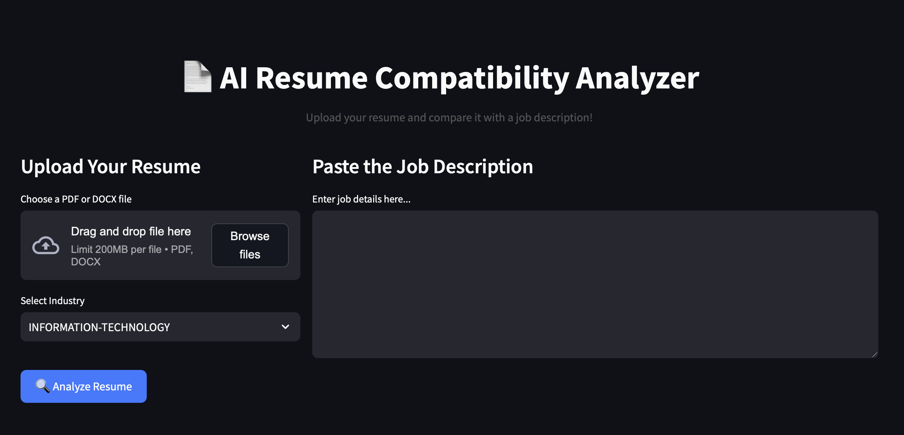

# 📄 AI Resume Compatibility Analyzer

🚀 **AI-powered tool that evaluates resume-job compatibility** by comparing uploaded resumes with job descriptions. It helps job seekers optimize their resumes for better alignment with job postings.

---

## **🔹 Features**
- 📂 Upload **PDF/DOCX** resumes
- 🏢 Select **industry** for better job matching
- 🔍 Analyze resume **compatibility with job descriptions**
- 📊 Receive **AI-driven improvement suggestions**
- 🎨 **Modern UI** with interactive elements

---

## **📌 How It Works**
1. Upload your resume (PDF or DOCX).
2. Paste a job description.
3. Select the **industry** from the dropdown.
4. Click **Analyze Resume**.
5. AI will compare the resume and job posting, providing **compatibility analysis & improvement suggestions**.

---

## **⚡ Quick Setup (Run Locally)**
1. Clone this repository: git clone https://github.com/Messinavu10/llm-resume-analyzer.git
2. Create a ".env" file and add your MistralAI API key.
3. Run "pip install -r requirements.txt"
4. Run "streamlit run app.py"